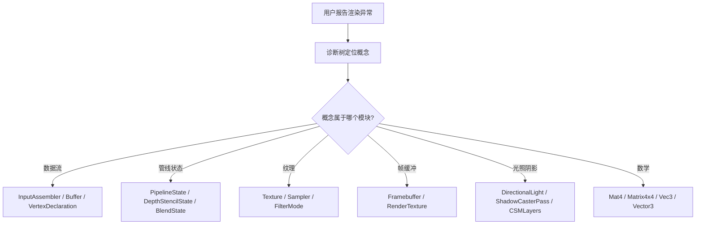

# OpenGL 图形学概念知识库

> **用这个知识库做什么：** 看到渲染 Bug → 定位到管线环节 → 找到引擎源码中对应的实现 → 精准修复。
> **什么时候用它：** 渲染异常排查、shader 调试、跨引擎概念翻译、性能瓶颈分析。
> **配合 CodeGraph：** 概念定位后，用 CodeGraph 查引擎源码中对应实现的具体代码。

---

## 一、渲染管线速查（数据怎么流）

```
顶点数据 → 顶点着色器 → [曲面细分] → [几何着色器] → 光栅化 → 片段着色器 → 深度/模板/混合 → 帧缓冲
```

每个阶段出问题的典型表现：
- **顶点着色器阶段** → 模型位置/形状错乱
- **光栅化阶段** → 锯齿、面朝向错误
- **片段着色器阶段** → 颜色/光照/纹理异常
- **深度测试阶段** → 遮挡关系错误、Z-Fighting
- **混合阶段** → 透明物体叠加顺序错误
- **帧缓冲阶段** → 后处理失效、渲染到纹理黑屏

---

## 二、核心概念字典（30+ 关键概念）

### 2.1 OpenGL 基础概念

| # | 概念 | 一句话 | 关键 API / 参数 |
|---|------|--------|-----------------|
| 1 | **Core Profile** | 现代 OpenGL，去掉了所有废弃的固定管线 API | glfwWindowHint(GLFW_OPENGL_PROFILE, GLFW_OPENGL_CORE_PROFILE) |
| 2 | **Immediate Mode** | 旧版 OpenGL（<=2.1），简单但低效，已废弃 | glBegin/glEnd（不再存在于 Core Profile） |
| 3 | **GLFW** | 窗口创建、上下文管理、输入处理的库 | glfwCreateWindow, glfwMakeContextCurrent |
| 4 | **GLAD** | OpenGL 函数指针加载库，定位 Core Profile 的地址 | gladLoadGL(glfwGetProcAddress) |
| 5 | **渲染循环** | 每帧清除缓冲 → 绘制 → 交换缓冲 → 处理事件 | glClear → glDrawElements → glfwSwapBuffers → glfwPollEvents |
| 6 | **状态机** | OpenGL 是一个巨大的状态机，修改状态后影响后续所有操作 | glBindBuffer, glUseProgram, glBindTexture |

### 2.2 数据流概念

| # | 概念 | 一句话 | 引擎对应 |
|---|------|--------|----------|
| 7 | **VAO** | 顶点格式说明书——告诉 GPU 怎么读 VBO 里的数据 | Unity: Mesh.SetVertexBufferParams |
| 8 | **VBO** | GPU 显存里的顶点数据数组（位置、法线、UV...） | Unity: Mesh.vertices |
| 9 | **EBO** | 索引数组——8 个顶点画一个立方体而不是 36 个 | Unity: Mesh.triangles |
| 10 | **FBO** | 渲染目标容器——渲染到纹理而不是屏幕 | Unity: RenderTexture |
| 11 | **UBO (Uniform Buffer Object)** | 批量传递 uniform 参数的缓冲，多个着色器程序共享 | Unity: MaterialPropertyBlock |

### 2.3 着色器概念

| # | 概念 | 一句话 | 用法要点 |
|---|------|--------|----------|
| 12 | **顶点着色器** | 逐顶点运行——把 3D 坐标变换到屏幕 | 强制定义，至少输出 gl_Position |
| 13 | **片段着色器** | 逐像素运行——决定最终颜色，视觉效果的核心 | 强制定义，至少输出颜色值 |
| 14 | **几何着色器** | 可创建/销毁图元——爆破效果、法线可视化 | 可选，输入是一个图元的一组顶点 |
| 15 | **曲面细分着色器** | 将图元细分增加细节——LOD 控制 | 包含 Hull + Domain 两个阶段，可选 |
| 16 | **GLSL** | OpenGL 着色器语言，C 风格，运行在 GPU 上 | 版本号必须与 OpenGL 匹配（3.3=330, 4.2=420） |
| 17 | **Uniform** | CPU→GPU 的全局变量，所有顶点/片段共享 | glGetUniformLocation + glUniformXxx 设置 |
| 18 | **顶点属性** | 每个顶点携带的数据（位置、法线、UV 等） | layout(location = n) in vec3 xxx |
| 19 | **in/out 变量** | 着色器阶段之间的数据传递 | 上一个阶段的 out = 下一个阶段的 in |
| 20 | **插值** | 片段着色器的输入变量由顶点数据光栅化插值而来 | 默认透视校正插值，flat 关键字可关闭 |

### 2.4 纹理概念

| # | 概念 | 一句话 | 关键参数 |
|---|------|--------|----------|
| 21 | **纹理对象** | GPU 上的图片数据+采样配置 | glTexImage2D + glTexParameter |
| 22 | **纹理单元** | 同时绑多张纹理的插槽（GL_TEXTURE0~GL_TEXTURE31） | glActiveTexture(GL_TEXTURE0 + n) |
| 23 | **纹理过滤** | 纹理放大/缩小时的采样方式 | GL_NEAREST（像素风） / GL_LINEAR（模糊） |
| 24 | **Mipmap** | 纹理的缩略图链——远处用小的，不闪烁 | glGenerateMipmaps + glTexParameteri(GL_TEXTURE_MIN_FILTER, GL_LINEAR_MIPMAP_LINEAR) |
| 25 | **纹理包裹** | UV 超过 [0,1] 时的处理方式 | GL_REPEAT / GL_MIRRORED_REPEAT / GL_CLAMP_TO_EDGE |
| 26 | **各向异性过滤** | 倾斜表面上的纹理清晰度 | glTexParameterf(GL_TEXTURE_MAX_ANISOTROPY) |
| 27 | **sRGB 纹理** | 在 sRGB 空间存储的纹理，着色器读取后自动转换到线性空间 | glTexImage2D(..., GL_SRGB_ALPHA) |
| 28 | **立方体贴图** | 6 张纹理围成立方体——天空盒、环境反射 | GL_TEXTURE_CUBEMAP_POSITIVE_X + 5 张兄弟纹理 |

### 2.5 坐标与变换概念

| # | 概念 | 一句话 | 关键公式 |
|---|------|--------|----------|
| 29 | **局部空间 (Local)** | 物体自身的坐标系统，建模软件中的原点 | 原始顶点坐标 |
| 30 | **世界空间 (World)** | 所有物体放在同一个大世界中，各自有位置/旋转/缩放 | × Model Matrix |
| 31 | **观察空间 (View)** | 以摄像机为原点的坐标系，摄像机朝向 -Z | × View Matrix (LookAt) |
| 32 | **裁剪空间 (Clip)** | 经过投影矩阵变换，视锥体内的坐标保留 | × Projection Matrix，然后 w 分量做透视除法 |
| 33 | **屏幕空间 (Screen)** | 最终像素坐标，由 glViewport 映射 | 自动完成 |
| 34 | **正交投影** | 没有透视效果，平行线永远平行 | 用于 2D、UI、阴影贴图 |
| 35 | **透视投影** | 近大远小，符合人眼视觉 | 需要设定 fov、宽高比、近/远平面 |
| 36 | **LookAt 矩阵** | 根据摄像机位置、目标点、上向量构建观察矩阵 | 核心：右向量(R) × 上向量(U) × 方向向量(D) 构造基 |
| 37 | **欧拉角** | 用偏航角(Yaw)+俯仰角(Pitch)+翻滚角(Roll)描述旋转 | 万向锁问题 (Gimbal Lock) 在俯仰 ±90° 时出现 |

### 2.6 光照概念

| # | 概念 | 一句话 | 公式/要点 |
|---|------|--------|-----------|
| 38 | **冯氏光照** | 环境光(Ambient)+漫反射(Diffuse)+镜面反射(Specular) | 经典光照模型，在片段着色器中逐像素计算 |
| 39 | **Blinn-Phong** | 用半程向量 H 替代反射向量 R，更高效 | H = normalize(L+V)，取代 R·V |
| 40 | **材质 (Material)** | 定义物体对光照的反应方式（环境/漫反射/镜面/光泽度） | 结构体统一传 Uniform |
| 41 | **光照贴图** | 用纹理控制物体不同区域的漫反射/镜面反射属性 | diffuse map + specular map |
| 42 | **平行光 (Directional)** | 所有光线平行，无衰减，模拟太阳光 | 只需要方向向量，位置无限远 |
| 43 | **点光源 (Point)** | 从一点向四周传播，有衰减 | 衰减公式：1.0/(Kc+Kl*d+Kq*d²) |
| 44 | **聚光灯 (Spot)** | 锥形光，有内角和外角，边缘柔化 | 通过 cos(φ) 与 cutoff 比较，inner/outer 过渡 |
| 45 | **多光源** | 同时处理多个不同类型的光源，求和叠加 | 遍历光源数组，分别计算贡献后累加 |
| 46 | **阴影映射** | 从光源视角渲染一次深度图，采样比较判断遮挡 | 深度贴图 + shadow bias（防阴影痤疮） |
| 47 | **PCF ( Percentage-Closer Filtering)** | 多次采样深度图求平均，软阴影 | 采样核大小直接影响阴影边缘质量 |
| 48 | **CSM (级联阴影映射)** | 按距离分段不同分辨率的阴影贴图，大场景用 | 近处高分辨率，远处低分辨率 |
| 49 | **点光源阴影** | 立方体贴图深度（6 个方向），全向阴影 | 使用 GL_DEPTH_COMPONENT + 几何着色器 |
| 50 | **法线贴图** | 用纹理编码凹凸细节，不增加顶点 | 切线空间 (Tangent Space) 的 TBN 矩阵 |
| 51 | **视差贴图** | 根据高度图偏移 UV，比法线贴图更强的立体感 | 视差遮挡映射 (POM) 效果最好，但最耗 |
| 52 | **HDR** | 颜色值超出 [0,1] 范围，保留亮部细节 | 配合 Tone Mapping 映射回 LDR |
| 53 | **Tone Mapping** | 将 HDR 颜色映射到 [0,1] 显示范围 | Reinhard / ACES / Filmic 等算子 |
| 54 | **Bloom** | 从 HDR 图像提取亮部 → 高斯模糊 → 叠加回原图 | 用两个 Pass：提取亮色 + 模糊 |
| 55 | **高斯模糊** | 用 NxN 高斯核卷积图像，可分离为两个 1D Pass | 垂直+水平分别模糊，性能提升显著 |
| 56 | **延迟渲染 (Deferred)** | 先渲染几何信息到 G-Buffer，再逐像素计算光照 | G-Buffer：位置/法线/颜色/材质等 MRTs |
| 57 | **SSAO (环境光遮蔽)** | 通过采样法线周围像素计算遮蔽近似值 | 基于屏幕空间的近似 AO，核大小影响质量 |

### 2.7 高级概念

| # | 概念 | 一句话 | 要点 |
|---|------|--------|------|
| 58 | **深度测试** | 比较片段深度，决定谁在前面 | glEnable(GL_DEPTH_TEST)，深度函数可配置 |
| 59 | **深度冲突 (Z-Fighting)** | 两个面深度值太接近，交替出现闪烁 | 近远平面比例不要太大，可加 depth bias |
| 60 | **模板测试** | 逐像素条件测试，在深度测试前执行 | 用于轮廓、反射、区域遮罩等效果 |
| 61 | **混合 (Blending)** | 新旧颜色按公式叠加，实现透明 | 需要关闭深度写入 (glDepthMask(GL_FALSE)) |
| 62 | **面剔除 (Face Culling)** | 丢弃背向摄像机的三角形 | 默认逆时针 (CCW) 为正面 |
| 63 | **帧缓冲 (FBO)** | 完全自定义渲染目标，后处理基础 | 可附加颜色/深度/模板附件 |
| 64 | **几何着色器 (GS)** | 在顶点着色器和光栅化之间，可增删改图元 | 输入：points/lines/triangles，输出同理 |
| 65 | **实例化 (Instancing)** | 一次绘制调用渲染多个相同物体 | glDrawArraysInstanced / gl_InstanceID |
| 66 | **MSAA** | 多重采样抗锯齿，每个像素采集多个深度样本 | glEnable(GL_MULTISAMPLE) 或手动 FBO 附件 |
| 67 | **Gamma 校正** | 显示器的亮度响应是非线性的（gamma ≈ 2.2） | 着色器输出时做 pow(color, 1.0/2.2) |
| 68 | **PBR (基于物理渲染)** | 能量守恒 + 微表面模型 + 菲涅耳效应 | Cook-Torrance BRDF |
| 69 | **Cook-Torrance BRDF** | 漫反射(Lambert) + 镜面反射(NDF×G×F) | D: 法线分布(GGX/Beckmann) G: 几何遮蔽 Smith F: Fresnel-Schlick |
| 70 | **IBL (基于图像的光照)** | 用环境贴图提供光照信息，PBR 的间接光照 | 漫反射 irradiance map + 镜面反射 pre-filtered map + BRDF LUT |

---

## 三、渲染 Bug 诊断树（症状 → 根因）

### 当用户说"画面有问题"时，按此流程排查：

```
第 0 步：分类症状
  ├── 颜色异常 → 走分支 A
  ├── 几何/形状异常 → 走分支 B
  ├── 光影/阴影异常 → 走分支 C
  ├── 透明/遮挡异常 → 走分支 D
  └── 性能卡顿 → 走分支 E

分支 A：颜色异常
  Q1: 所有物体还是单个物体？
    → 单个: 检查该物体的材质/纹理 → 纹理过滤、sRGB 格式、着色器 uniform
    → 全部: 检查全局设置 → Gamma 校正、HDR、色调映射、后处理
  Q2: 是一直偏暗还是某些角度？
    → 一直偏暗: Gamma/sRGB 转换遗漏
    → 特定角度: 光照计算错误（法线方向、光照方向）

分支 B：几何/形状异常
  Q1: 模型完全不显示？
    → VAO 未绑定 / 面剔除方向反了 / 顶点数据错误
  Q2: 模型显示但位置或形状不对？
    → MVP 矩阵顺序错 / 坐标系混淆 / 顶点属性错位

分支 C：光影/阴影异常
  Q1: 阴影有锯齿？→ Shadow Map 分辨率低 / 缺 PCF
  Q2: 阴影有条纹（痤疮）？→ depth bias 不够
  Q3: 阴影和物体分离？→ bias 太大（彼得潘现象）
  Q4: 法线贴图不生效？→ 切线空间 TBN 矩阵错误
  Q5: 镜面高光位置不对？→ 用的是 Phong 还是 Blinn-Phong / 法线方向

分支 D：透明/遮挡异常
  Q1: 透明物体挡住其他透明物体？
    → 渲染顺序错误：需关 ZWrite，从远到近排
  Q2: 不透明物体被透明物体挡住？
    → 先画不透明（开 ZWrite），再画透明（关 ZWrite）
  Q3: 两个面交替闪烁？→ Z-Fighting: 近远平面比例太大

分支 E：性能卡顿
  Q1: 看什么方向最卡？→ 过度绘制（粒子叠层）/ Draw Call 太多
  Q2: 静止也卡？→ 纹理带宽瓶颈 / 着色器太复杂
  Q3: 特定物体出现时卡？→ 顶点数太多 / 纹理分辨率太高

分支 F：后处理失效
  Q1: Bloom 效果太弱/太强？
    → 提取亮度的阈值调低/调高 / 高斯模糊 Pass 次数太少/太多
  Q2: 延迟渲染 G-Buffer 显示异常？
    → MRT 输出顺序和 G-Buffer 读取不一致 / 位置/法线编码方式不同
  Q3: HDR 画面过曝或发灰？
    → Tone Mapping 算子选择不对 / HDR 颜色值范围溢出
  Q4: SSAO 伪影或闪烁？
    → 采样核太小/太大 / 缺少 blur Pass / 法线噪声匹配问题
  Q5: Gamma 校正后颜色偏暗？
    → 纹理未标记 sRGB 导致双重 Gamma / 校正公式应用错误

分支 G：抗锯齿异常
  Q1: 轮廓锯齿明显？→ 未启用 MSAA / MSAA 样本数太低
  Q2: MSAA 后画面模糊？→ 多重采样纹理在后续 Pass 中被错误降采样
  Q3: 边缘闪烁（时间锯齿）？→ 需 TAA（时间抗锯齿），MSAA 无法处理

分支 H：PBR 渲染异常
  Q1: 金属感太强或太弱？
    → 金属度(Metalness)值错误 / 粗糙度(Roughness)过高使反射散开
  Q2: 颜色偏暗？
    → HDR 环境贴图未正确加载 / IBL irradiance map 质量低
  Q3: 菲涅耳效应消失？
    → Fresnel-Schlick 公式中基础反射率 F0 设置错误（金属 ≠ 非金属）
  Q4: 间接光照贡献不对？
    → IBL 漫反射 irradiance map + 镜面反射 pre-filtered map 缺失
```

---

## 四、GLSL 着色器速查

### 4.1 常见内置变量

| 变量 | 阶段 | 含义 |
|------|------|------|
| `gl_Position` | 顶点 | 裁剪空间输出位置（必须设置） |
| `gl_FragCoord` | 片段 | 屏幕空间坐标 (x, y, z=深度) |
| `gl_FrontFacing` | 片段 | 当前片段是否属于正面三角形 |
| `gl_PointSize` | 顶点 | 点精灵的大小 |
| `gl_VertexID` | 顶点 | 当前顶点的索引 |
| `gl_InstanceID` | 顶点 | 当前实例的索引（实例化时使用） |
| `gl_PrimitiveID` | 几何/片段 | 当前图元编号 |

### 4.2 常用 GLSL 函数

| 函数 | 用途 |
|------|------|
| `dot(a, b)` | 点积，光照计算核心 |
| `cross(a, b)` | 叉积，构造 TBN 矩阵、法线 |
| `normalize(v)` | 归一化向量 |
| `reflect(I, N)` | 反射向量，镜面反射 |
| `refract(I, N, eta)` | 折射向量，玻璃效果 |
| `mix(a, b, t)` | 线性插值，Lerp |
| `clamp(v, min, max)` | 钳制到范围 |
| `smoothstep(edge0, edge1, v)` | 平滑阶跃函数，边缘过渡 |
| `texture(sampler, uv)` | 采样纹理 |
| `textureCube(sampler, dir)` | 采样立方体贴图 |
| `pow(x, y)` | 幂运算，高光/Gamma 校正 |
| `length(v)` | 向量长度，距离计算 |
| `faceforward(N, I, Nref)` | 法线朝向修正 |

### 4.3 调试技巧

- **将颜色编码为可视值**：`outColor = vec4(normalize(v_Normal) * 0.5 + 0.5, 1.0)` 显示法线
- **显示 UV**：`outColor = vec4(uv.x, uv.y, 0.0, 1.0)` 检查纹理坐标
- **显示深度**：`outColor = vec4(vec3(gl_FragCoord.z), 1.0)` 深度可视化
- **条件绘制**：`if (gl_FragCoord.x < threshold) discard;` 用于定位渲染区域
- **性能调试**：在顶点/片段着色器中注释掉部分代码，逐步定位瓶颈

---

## 五、OpenGL ↔ 引擎翻译表

| OpenGL | Unity | Unreal | Godot | Cocos Creator 4.0 | LayaAir 3.3 |
|--------|-------|--------|-------|-------------------|-------------|
| VAO+VBO | Mesh.vertices + SetVertexBufferParams | FStaticMeshVertexBuffer | ArrayMesh | InputAssembler + Buffer(Vertex) | VertexBuffer + VertexDeclaration |
| EBO/IBO | Mesh.triangles | FStaticMeshIndexBuffer | — | Buffer(Index) | IndexBuffer |
| FBO | RenderTexture | SceneCaptureComponent | ViewportTexture | Framebuffer + RenderPass | RenderTexture + InternalRenderTarget |
| Depth Test | ZWrite, ZTest | Depth Stencil State | depth_draw_mode | DepthStencilState.depthTest/depthWrite | RenderStateType.DepthTest/DepthFunc |
| Depth Compare | ZTest | Depth Stencil State | depth_draw_mode | ComparisonFunc (LESS, EQUAL...) | CompareFunction (Less, Equal...) |
| Stencil | Stencil 命令 | Stencil Buffer | — | DepthStencilState.stencilTestFront/Back | StencilState + RenderStateType.StencilTest |
| Blend | Blend 命令 | Blend Mode | blend_mode | BlendState + BlendTarget | BlendState + BlendComponent |
| Mipmap | Generate Mip Maps | Texture Mip Gen | mipmaps | TextureFlagBit.GEN_MIPMAP + sampler.mipFilter | FilterMode (Point/Bilinear/Trilinear) |
| Texture Filter | Filter Mode | Texture Filtering | texture_filter | Filter (POINT/LINEAR/ANISOTROPIC) | FilterMode (Point/Bilinear/Trilinear) |
| Texture Wrap | Wrap Mode | Texture Addressing | wrap_mode | Address (WRAP/MIRROR/CLAMP) | WrapMode (Repeat/Clamp/Mirrored) |
| Face Culling | Cull 命令 | Two Sided | cull_mode | CullMode (NONE/FRONT/BACK) | CullMode (Off/Front/Back) |
| Depth Bias | Depth Bias | Shadow Bias | depth_bias | RasterizerState.depthBias/depthBiasSlop | ShadowCasterPass bias params |
| Shadow Map | Shadow settings | Light Mobility | Shadow settings | shadow/shadow-flow.ts + CSM | ShadowCasterPass + ShadowSliceData |
| Instancing | GPU Instancing | ISMC Instancing | MultiMeshInstance | instanced-buffer + render-instanced-queue | VertexBuffer.instanceBuffer |
| Uniform | Material.SetFloat() | Material Parameter | shader.set_shader_parameter() | DescriptorSet + PipelineLayout | Material.setFloat() / setTexture() |

---

## 六、配合 CodeGraph 使用

当通过以上诊断锁定概念后，用 CodeGraph 定位引擎源码：

```bash
# 示例：诊断出是"阴影映射 bias 不够"
# → 查引擎中相关实现
codegraph explore "shadow bias depth offset unity"

# 返回 ShadowUtils.cs 中 SetupShadowCasterConstantBuffer() 的源码
# → AI 看到 m_ShadowBias 变量 → 指导用户调参
```

**工作流程：** 现象 → 诊断树定位概念 → CodeGraph 查源码 → 精准修复方案

---

## 七、关键数学公式大全

| # | 公式 | 用途 | 说明 |
|---|------|------|------|
| 1 | `MVP = P × V × M` | 顶点变换到裁剪空间 | 右乘！代码中：`gl_Position = P * V * M * vec4(localPos, 1.0)` |
| 2 | `N·L = cosθ` | 漫反射强度 (Lambert) | 当 N 和 L 都是单位向量时，结果为 cos(θ) |
| 3 | `H = normalize(L + V)` | Blinn-Phong 半程向量 | 比反射向量 R 计算更高效 |
| 4 | `(R·V)^s` | Phong 镜面高光 | R = reflect(-L, N)，s 为光泽度(shininess) |
| 5 | `(N·H)^s` | Blinn-Phong 镜面高光 | 更高效，结果略不同，一般在片段着色器中计算 |
| 6 | `Result = Src × Fsrc + Dst × Fdst` | 混合公式 | 控制透明叠加行为 |
| 7 | `1.0 / (Kc + Kl·d + Kq·d²)` | 点光源衰减 | Kc=常数, Kl=线性, Kq=二次衰减系数 |
| 8 | `F = F0 + (1 - F0)(1 - H·V)^5` | Fresnel-Schlick 近似 | PBR 镜面反射菲涅耳项，F0 是 0° 入射的反射率 |
| 9 | `D = α² / π( (N·H)²(α²-1) + 1 )²` | GGX 法线分布 | PBR 的微表面法线分布函数，α=roughness² |
| 10 | `G = 2(N·V)(N·L) / (V·H)²` | Smith 几何遮蔽 | PBR 的几何函数，处理微表面互相遮挡 |
| 11 | `pow(color, 1.0/2.2)` | Gamma 校正 | 将线性空间颜色转换为 sRGB 显示 |
| 12 | `color / (color + vec3(1.0))` | Reinhard Tone Mapping | 简单 HDR 色调映射 |
| 13 | `LookAt = [Rx Ry Rz 0, Ux Uy Uz 0, Dx Dy Dz 0, 0 0 0 1]·T` | 观察矩阵构建 | R=右向量, U=上向量, D=方向向量（-目标方向）, T=平移负位置 |
| 14 | `P_ortho = [2/w 0 0 0, 0 2/h 0 0, 0 0 -2/(f-n) 0, 0 0 -(f+n)/(f-n) 1]` | 正交投影矩阵 | w=宽, h=高, n=近平面, f=远平面 |
| 15 | `P_persp = [1/(a·tan(fov/2)) 0 0 0, 0 1/tan(fov/2) 0 0, 0 0 -(f+n)/(f-n) -2fn/(f-n), 0 0 -1 0]` | 透视投影矩阵 | a=宽高比, fov=视场角, n=近平面, f=远平面 |

---

## 八、常见 OpenGL 代码模式

### 8.1 初始化一个三角形（Core Profile）

```cpp
// 1. 生成 VAO + VBO
unsigned int VAO, VBO;
glGenVertexArrays(1, &VAO);
glGenBuffers(1, &VBO);

// 2. 绑定 VAO → 绑定 VBO → 设置顶点属性
glBindVertexArray(VAO);
glBindBuffer(GL_ARRAY_BUFFER, VBO);
glBufferData(GL_ARRAY_BUFFER, sizeof(vertices), vertices, GL_STATIC_DRAW);
glVertexAttribPointer(0, 3, GL_FLOAT, GL_FALSE, 3 * sizeof(float), (void*)0);
glEnableVertexAttribArray(0);

// 3. 编译着色器 → 链接程序
unsigned int shaderProgram = glCreateProgram();
// ... 编译 vertex/fragment shader，附加到 program，链接

// 4. 渲染循环
while (!glfwWindowShouldClose(window)) {
    glClear(GL_COLOR_BUFFER_BIT | GL_DEPTH_BUFFER_BIT);
    glUseProgram(shaderProgram);
    glBindVertexArray(VAO);
    glDrawArrays(GL_TRIANGLES, 0, 3);
    glfwSwapBuffers(window);
    glfwPollEvents();
}
```

### 8.2 常见 OpenGL 枚举值

| 枚举 | 值（十六进制） | 用途 |
|------|---------------|------|
| `GL_ARRAY_BUFFER` | 0x8892 | 顶点缓冲区绑定目标 |
| `GL_ELEMENT_ARRAY_BUFFER` | 0x8893 | 索引缓冲区绑定目标 |
| `GL_STATIC_DRAW` | 0x88E4 | 数据不变，多次绘制 |
| `GL_DYNAMIC_DRAW` | 0x88E8 | 数据频繁变化 |
| `GL_TRIANGLES` | 0x0004 | 三角形图元 |
| `GL_TRIANGLE_STRIP` | 0x0005 | 三角形条带（更高效） |
| `GL_FLOAT` | 0x1406 | 32 位浮点数类型 |
| `GL_UNSIGNED_INT` | 0x1405 | 32 位无符号整数 |
| `GL_LINEAR` | 0x2601 | 线性纹理过滤 |
| `GL_NEAREST` | 0x2600 | 最近点纹理过滤（像素风） |
| `GL_CLAMP_TO_EDGE` | 0x812F | 纹理寻址模式：钳制到边缘 |
| `GL_REPEAT` | 0x2901 | 纹理寻址模式：重复 |
| `GL_MIRRORED_REPEAT` | 0x8370 | 纹理寻址模式：镜像重复 |
| `GL_DEPTH_TEST` | 0x0B71 | 深度测试启用 |
| `GL_STENCIL_TEST` | 0x0B90 | 模板测试启用 |
| `GL_BLEND` | 0x0BE2 | 混合启用 |
| `GL_CULL_FACE` | 0x0B44 | 面剔除启用 |
| `GL_MULTISAMPLE` | 0x809D | 多重采样抗锯齿启用 |
| `GL_FRAMEBUFFER` | 0x8D40 | 帧缓冲绑定目标 |
| `GL_TEXTURE0~GL_TEXTURE31` | 0x84C0~0x84DF | 纹理单元 |

---

## 九、引擎架构概念（渲染管线之上的层）

> 以下概念是纯 GPU 渲染之上的"引擎层"——OpenGL 不管这些，但每个游戏引擎必须实现。

### 7.1 场景图与变换层级

| 概念 | 一句话 | Cocos Creator 4.0 | LayaAir 3.3 |
|------|--------|-------------------|-------------|
| **场景图** | 树形结构组织所有物体，父节点变换影响子节点 | `Scene` → `Node` → `children: Node[]` | `Scene` → `Sprite` → `_children` |
| **局部→世界变换** | 每个节点存 local 变换，递归乘父矩阵得世界变换 | `Node.worldMatrix`, `Node.position` | `Sprite.transform` → 递归计算 |
| **脏标记** | 只有"变了"才重算世界矩阵，省性能 | `_worldMatDirty` 标记 | `_transformChanged` |

**常见 Bug 诊断：**
- 子物体位置不对 → 父节点矩阵未更新 / 脏标记没置位
- 旋转后坐标系错乱 → 世界空间 vs 局部空间计算错误
- 大量节点移动卡顿 → 脏标记传播过深，需要手动 `updateWorldTransform()`

### 7.2 渲染管线架构

| 维度 | Cocos Creator 4.0 | LayaAir 3.3 |
|------|-------------------|-------------|
| **架构风格** | **FrameGraph**（声明式）：`RenderGraph` 描述整个帧的依赖关系 → `ExecutorContext` 执行 | **命令式**：`RenderContext3D` → `Laya3DRender` → 逐个 `CommandBuffer` 提交 |
| **管线类型** | Forward / Deferred / Custom | 主要 Forward |
| **渲染队列** | `RenderQueue`, `RenderInstancedQueue` | `BaseRender` 管理 `IRenderElement3D[]` |
| **可见性** | `SceneCulling` 显式剔除 | 集成在渲染遍历中 |

**Cocos FrameGraph 流程：**
```
RenderGraph 构建 → 资源依赖分析 → SceneCulling 剔除
    → ExecutorContext 分配 GPU 资源 → 并行录制 CommandBuffer → 提交
```

**Laya 渲染流程：**
```
RenderContext3D 每帧遍历 → Camera culling → 
    Laya3DRender.render() → BaseRender 排序 → CommandBuffer.submit()
```

**常见 Bug 诊断：**
- 某个 Pass 不渲染 → Cocos: FrameGraph 依赖链断了；Laya: BaseRender 没注册
- 渲染顺序错乱 → Cocos: RenderQueue 优先级；Laya: `renderQueue` 排序

### 7.3 剔除系统

| 剔除类型 | 原理 | Cocos Creator 4.0 | LayaAir 3.3 |
|---------|------|-------------------|-------------|
| **视锥剔除** | 物体包围盒完全在摄像机视锥外 → 不渲染 | `SceneCulling.frustumCulling()` | Camera 遍历时 AABB 检测 |
| **遮挡剔除** | 被前面物体完全挡住 → 不渲染 | 基于深度缓冲的 Occlusion Query | 无显式实现 |
| **LOD** | 远处用低模 | `LODGroup` 组件 | `HLOD` / `LODGroup` 组件 |

**常见 Bug：**
- 物体在屏幕边缘消失 → 包围盒计算偏小 / 视锥检测过于激进
- LOD 切换时有跳变 → LOD 距离阈值太近 / 缺少过渡混合

### 7.4 合批与实例化

| 概念 | 解释 | Cocos Creator 4.0 | LayaAir 3.3 |
|------|------|-------------------|-------------|
| **静态合批** | 不动的物体合并成一个大 Mesh | `StaticBatcher` | 编辑器预处理 |
| **动态合批** | 小 Mesh 动态合并 | `DynamicBatcher` | `SpineInstanceBatch` (针对性) |
| **GPU Instancing** | 一个 Draw Call 画多个相同物体 | `RenderInstancedQueue` + `InstancedBuffer` | `VertexBuffer.instanceBuffer` |

**Draw Call 过多诊断：**
- Cocos: 看 `RenderInstancedQueue` 是否启用 → 检查 Material 是否支持 instancing
- Laya: 看 `instanceBuffer` 是否激活 → 检查 VertexBuffer 的 `_instanceBuffer` 标记
- 通用: 同 Material 同 Mesh → 可合批；不同 Material → 需打断

### 7.5 组件系统

| 引擎 | 模式 | 添加方式 | 生命周期 |
|------|------|---------|---------|
| **Cocos** | `Node.addComponent<T>()`（类 Unity） | `node.addComponent(MyScript)` | `onLoad → start → update → onDestroy` |
| **Laya** | `ComponentDriver` 注册 | `node.addComponentIntance(component)` | `_addComponent → _init → _update → _destroy` |

**常见 Bug：**
- 组件 `update` 不调用 → 没加到正确节点 / 组件被禁用
- Cocos: `this.node` 为空 → `onLoad` 之前访问
- Laya: 组件 `owner` 没设置 → 忘记调用 `_setOwner`

### 7.6 资源生命周期

| 概念 | 解释 | 关键点 |
|------|------|--------|
| **引用计数** | 资源被引用时+1，释放时-1，归零才真释放 | `Asset.addRef()` / `Asset.decRef()` |
| **懒加载** | 用到才加载，不用不占内存 | 异步加载 → 回调设置 |
| **资源释放** | 场景切换时清理 | 注意：纹理/Mesh 可能被多个对象共享 |

**常见 Bug：**
- 切换场景后纹理变黑 → 资源被提前释放 / 引用计数为 0
- 内存泄漏 → 资源引用没释放（事件监听、闭包持有引用）
- Cocos: `resources.load()` 后的纹理需要手动 `release()`
- Laya: `Laya.loader.create()` → `texture.destroy()`

### 7.7 引擎架构差异速查表

| 场景 | Cocos Creator 4.0 做法 | LayaAir 3.3 做法 |
|------|------------------------|-------------------|
| 获取主摄像机 | `director.root.cameraList[0]` | `Scene3D._camera` |
| 遍历场景节点 | `scene.walk(node => ...)` | `scene._children` 递归 |
| 创建材质 | `new Material()` + `material.initialize({ effectAsset })` | `new Material()` + `material.setShaderName()` |
| 设置 RenderTexture | `camera.targetTexture = rt` | `RenderTexture` + `CommandBuffer.drawToRenderTexture2D()` |
| 强制更新变换 | `node.updateWorldTransform()` | `sprite._update()` |
| GPU Instancing | Material 勾选 `useInstancing` | `VertexBuffer.instanceBuffer = true` |

---

## 十、使用原则

1. **不要对用户抛概念** — 除非用户问"为什么"，否则优先用引擎术语回答
2. **诊断时先问问题** — 不要看一个模糊描述就给解决方案，按诊断树走
3. **概念是工具不是目的** — 用户只关心"怎么修好"，不关心 OpenGL，只在解释根因时引用
4. **跨引擎翻译** — 当用户说"Unity 里的 XXX"，用此知识库找到概念 ⮕ 翻译到目标引擎
5. **CodeGraph 配合** — 概念定位后，用 CodeGraph 查引擎源码中的具体实现
6. **来源标注** — 本知识库基于 learnopengl.com 全部教程内容整理

---

## 十一、Cocos Creator 4.0 ↔ LayaAir 3.3 源码映射表

> 以下映射基于源码目录对照：Cocos `D:\LAYAMCP\cocos4-4.0.0` | LayaAir `D:\LAYAMCP\LayaAir-LayaAir_3.3`

### 11.1 数据流（VAO / VBO / EBO / UBO）

| OpenGL 概念 | Cocos Creator 4.0 源码 | LayaAir 3.3 源码 |
|------------|----------------------|-------------------|
| **VAO** (顶点格式说明) | `cocos/gfx/base/input-assembler.ts` — `InputAssembler` 类，存 `attributes: Attribute[]` + `vertexBuffers: Buffer[]` + `indexBuffer` | `src/layaAir/laya/RenderEngine/VertexDeclaration.ts` — `VertexDeclaration` 类记录顶点属性布局；`VertexBuffer._vertexDeclaration` |
| **VBO** (顶点缓冲) | `cocos/gfx/base/buffer.ts` — `Buffer` 类，`BufferUsageBit.VERTEX`，配合 `glGenBuffers` + `glBufferData` | `src/layaAir/laya/RenderEngine/VertexBuffer.ts` — `VertexBuffer extends Buffer`，targetType=`ARRAY_BUFFER` |
| **EBO/IBO** (索引缓冲) | `cocos/gfx/base/buffer.ts` — `Buffer` 类，`BufferUsageBit.INDEX`，targetType=`ELEMENT_ARRAY_BUFFER` | `src/layaAir/laya/RenderEngine/IndexBuffer.ts` — `IndexBuffer`，targetType=`ELEMENT_ARRAY_BUFFER` |
| **UBO** (Uniform缓冲) | `cocos/gfx/base/buffer.ts` — `BufferUsageBit.UNIFORM`，`cocos/rendering/pipeline-ubo.ts` — `PipelineUBO` 类定义 UBO 布局 | `src/layaAir/laya/RenderEngine/RenderEnum/BufferTargetType.ts` — `UNIFORM_BUFFER` 枚举 |
| **顶点属性** | `cocos/gfx/base/define.ts` — `Attribute` 接口 (name, format, isNormalized, stream, isInstanced, location) | `src/layaAir/laya/RenderEngine/VertexAttributeLayout.ts` — 顶点属性布局定义 |
| **GPU 实例化** | `cocos/rendering/render-instanced-queue.ts` — `RenderInstancedQueue` + `instanced-buffer.ts` — `InstancedBuffer` | `VertexBuffer.instanceBuffer = true` + `gl_InstanceID` 对应 |

### 11.2 帧缓冲与渲染目标

| OpenGL 概念 | Cocos Creator 4.0 源码 | LayaAir 3.3 源码 |
|------------|----------------------|-------------------|
| **FBO** (帧缓冲) | `cocos/gfx/base/framebuffer.ts` — `Framebuffer` 类，存 `_colorTextures[]` + `_depthStencilTexture` + `_renderPass` | `src/layaAir/laya/resource/RenderTexture.ts` — `RenderTexture`；Driver 层 `framebuffer` 实现 |
| **RenderPass** | `cocos/gfx/base/render-pass.ts` — `RenderPass` 类，声明 color/depth attachments + loadOp/storeOp | 无显式 RenderPass 类，通过 `CommandBuffer` 序列组织 |
| **RenderTarget** | `Framebuffer.colorTextures[0]` 作为输出目标 | `RenderTexture` + `CommandBuffer.drawToRenderTexture2D()` |
| **MRT** (多渲染目标) | `Framebuffer` 的 `_colorTextures` 数组支持多附件 | `RenderTexture` 可绑多个 color attachment |
| **深度附件** | `Framebuffer._depthStencilTexture` | `RenderTexture.depthStencilFormat` 参数 |

### 11.3 管线状态（深度 / 模板 / 混合 / 剔除）

| OpenGL 概念 | Cocos Creator 4.0 源码 | LayaAir 3.3 源码 |
|------------|----------------------|-------------------|
| **深度测试** | `cocos/gfx/base/pipeline-sub-state.ts` — `DepthStencilState`：`depthTest`, `depthWrite`, `depthFunc` (ComparisonFunc.LESS 等) | `src/layaAir/laya/RenderEngine/RenderEnum/CompareFunction.ts` — `CompareFunction.Less` 等 |
| **深度比较函数** | `define.ts` — `ComparisonFunc` 枚举 (NEVER, LESS, EQUAL, LEQUAL, GREATER, NOTEQUAL, GEQUAL, ALWAYS) | `CompareFunction` 枚举 (Never, Less, Equal, LessEqual, Greater, NotEqual, GreaterEqual, Always) |
| **深度偏移 (Depth Bias)** | `RasterizerState`：`depthBiasEnabled`, `depthBias`, `depthBiasClamp`, `depthBiasSlop` | `ShadowCasterPass.SHADOW_BIAS` = `u_ShadowBias` uniform |
| **模板测试** | `DepthStencilState`：`stencilTestFront/Back`, `stencilFuncFront/Back`, `stencilPassOp/FailOp/ZFailOp`, `stencilReadMask/WriteMask` | `src/layaAir/laya/RenderEngine/StencilState.ts` — `StencilState` 类 |
| **混合 (Blending)** | `pipeline-sub-state.ts` — `BlendState` + `BlendTarget`：`blend`, `blendSrc`, `blendDst`, `blendEq`, `blendColorMask` | `src/layaAir/laya/RenderEngine/BlendState.ts` — `BlendState` + `BlendComponent` (BlendFactor, BlendEquationSeparate) |
| **面剔除 (Culling)** | `RasterizerState`：`cullMode` (CullMode.NONE/FRONT/BACK), `isFrontFaceCCW` | `src/layaAir/laya/RenderEngine/RenderEnum/CullMode.ts` — `CullMode.Off/Front/Back` + `FrontFace.CW/CCW` |
| **光栅化** | `RasterizerState`：`polygonMode` (FILL/POINT/LINE), `lineWidth`, `isDiscard`, `isMultisample` | `src/layaAir/laya/RenderEngine/RenderEnum/RenderPologyMode.ts` — RenderPolygonMode |
| **管线状态对象 (PSO)** | `pipeline-state.ts` — `PipelineState` 整合：Shader + RenderPass + InputState + RasterizerState + DepthStencilState + BlendState + PrimitiveMode | 无显式 PSO，状态通过 `RenderStateCommand` 逐个设置后调用 `LayaGL.renderEngine.applyRenderStateCMD()` |

### 11.4 着色器

| OpenGL 概念 | Cocos Creator 4.0 源码 | LayaAir 3.3 源码 |
|------------|----------------------|-------------------|
| **Shader Program** | `cocos/gfx/base/shader.ts` — `Shader` 类，存 `ShaderStage[]` (VERTEX/FRAGMENT/COMPUTE) | `src/layaAir/laya/RenderEngine/RenderShader/Shader3D.ts` — `Shader3D` 类 |
| **GLSL 编译** | `cocos/gfx/webgl/webgl-shader.ts` — `WebGLShader` 实现 `glCreateShader` + `glShaderSource` + `glCompileShader` | `src/layaAir/laya/webgl/shader/` — WebGL shader 编译 |
| **Uniform** | `cocos/gfx/base/pipeline-layout.ts` + `descriptor-set-layout.ts` — `DescriptorSetLayout` 定义 uniform 绑定 | `Shader3D.propertyNameToID("u_XXX")` — 字符串到 ID 映射；`CommandUniformMap` |
| **顶点着色器** | `gfx/base/shader.ts` — ShaderStage.VERTEX | `Shader3D` 内置顶点着色器阶段 |
| **片段着色器** | `gfx/base/shader.ts` — ShaderStage.FRAGMENT | `Shader3D` 内置片段着色器阶段 |
| **Uniform 块** | `Shader` 的 `blocks: UniformBlock[]` | `CommandUniformMap` + ShaderData 绑定 |

### 11.5 纹理与采样

| OpenGL 概念 | Cocos Creator 4.0 源码 | LayaAir 3.3 源码 |
|------------|----------------------|-------------------|
| **纹理对象** | `cocos/gfx/base/texture.ts` — `Texture` 类，`TextureInfo`：type, usage, format, width, height, samples, flags 等 | `src/layaAir/laya/resource/Texture2D.ts` / `TextureCube.ts` 等 |
| **纹理过滤** | `cocos/gfx/base/states/sampler.ts` — `SamplerInfo`：minFilter, magFilter, mipFilter (LINEAR/NEAREST/ANISOTROPIC) | `src/layaAir/laya/RenderEngine/RenderEnum/FilterMode.ts` — FilterMode 枚举 |
| **纹理包裹** | `SamplerInfo`：addressU, addressV, addressW (WRAP/MIRROR/CLAMP) | `src/layaAir/laya/RenderEngine/RenderEnum/WrapMode.ts` — WrapMode (Repeat/Clamp/Mirrored) |
| **Mipmap** | `TextureInfo` — levelCount 字段，SamplerInfo — mipFilter (LINEAR_MIPMAP_LINEAR) | Texture 的 `mipmap` 属性 |
| **各向异性** | `SamplerInfo` — maxAnisotropy | FilterMode 中 Anisotropic 选项 |
| **sRGB** | `Format.SRGB8_A8` 等 sRGB 格式在 define.ts 中定义 | `TextureDecodeFormat` 控制 |
| **立方体贴图** | `Texture` type=`TextureType.CUBE` | `TextureCube` 类 |
| **纹理单元** | `DescriptorSet` 绑定多个 Texture + Sampler 到 binding 点 | `Shader3D` 自动分配纹理单元 |

### 11.6 渲染管线

| OpenGL 概念 | Cocos Creator 4.0 源码 | LayaAir 3.3 源码 |
|------------|----------------------|-------------------|
| **前向渲染** | `cocos/rendering/forward/forward-stage.ts` — `ForwardStage extends RenderStage`；管理 `RenderQueue[]` + `RenderInstancedQueue` | `src/layaAir/laya/d3/core/render/` — 前向渲染遍历 |
| **延迟渲染** | `cocos/rendering/deferred/` — Deferred 管线实现，G-Buffer 写入 MRT | 主要使用 Forward，无单独 Deferred 实现 |
| **渲染队列** | `cocos/rendering/render-queue.ts` — `RenderQueue` 支持 TRANSPARENT/OPAQUE 排序（FRONT_TO_BACK / BACK_TO_FRONT） | `BaseRender` 管理 `IRenderElement3D[]` 排序提交 |
| **CommandBuffer** | `cocos/gfx/base/command-buffer.ts` — `CommandBuffer` 录制 drawCall、状态切换、资源绑定 | 无显式 CommandBuffer，通过 `RenderContext3D` 直接提交 |
| **FrameGraph** | `cocos/rendering/custom/` — 声明式 FrameGraph 架构（RenderGraph 构建资源依赖） | 无 FrameGraph，命令式提交 |
| **Bloom** | `cocos/rendering/render-pipeline.ts` — `BloomRenderData`：prefilterTex → downsampleTexs → upsampleTexs → combineTex | `src/layaAir/laya/d3/postProcessEffect/` 后处理效果 |
| **UI 阶段** | `cocos/rendering/ui-phase.ts` — `UIPhase` | UI 独立渲染层 |

### 11.7 光照

| OpenGL 概念 | Cocos Creator 4.0 源码 | LayaAir 3.3 源码 |
|------------|----------------------|-------------------|
| **平行光** | `cocos/render-scene/scene/directional-light.ts` — `DirectionalLight` | `src/layaAir/laya/d3/core/light/DirectionLightCom.ts` — `DirectionLightCom` |
| **点光源** | `cocos/render-scene/scene/point-light.ts` — `PointLight` | `src/layaAir/laya/d3/core/light/PointLightCom.ts` — `PointLightCom` |
| **聚光灯** | `cocos/render-scene/scene/spot-light.ts` — `SpotLight` | `src/layaAir/laya/d3/core/light/SpotLightCom.ts` — `SpotLightCom` |
| **环境光** | `cocos/render-scene/scene/ambient.ts` — `Ambient` | `Scene3D.ambientColor` 属性 |
| **额外光源队列** | `cocos/rendering/render-additive-light-queue.ts` — `RenderAdditiveLightQueue` | `LightQueue.ts` 管理多光源 |
| **IBL** | `cocos/gi/light-probe/` — 光照探针 | 无显式 IBL 探针系统 |

### 11.8 阴影映射

| OpenGL 概念 | Cocos Creator 4.0 源码 | LayaAir 3.3 源码 |
|------------|----------------------|-------------------|
| **Shadow Map** | `cocos/rendering/shadow/csm-layers.ts` — `ShadowLayerVolume` 管理 CSM 各级；`cocos/rendering/render-shadow-map-batched-queue.ts` | `src/layaAir/laya/d3/shadowMap/ShadowCasterPass.ts` — `ShadowCasterPass`，定义 uniform 映射 (u_ShadowBias, u_ShadowMap 等) |
| **CSM** | `csm-layers.ts` — `CSMLayers`，支持 1~4 级联，`CSMOptimizationMode` (FIT_TO_SCENE/PSSM) | `src/layaAir/laya/d3/core/light/ShadowCascadesMode.ts` — `ShadowCascadesMode` |
| **Shadow Bias** | `RasterizerState.depthBias` / `depthBiasSlop` | `ShadowCasterPass.SHADOW_BIAS` = `u_ShadowBias` |
| **PCF** | 着色器端软阴影采样 (`shadowStage.ts` 控制采样核) | 着色器端 PCF 采样 |
| **阴影切片** | `csm-layers.ts` — `ShadowLayerVolume` (level 0~3) | `ShadowSliceData.ts` — 每级阴影的矩阵/范围数据 |

### 11.9 场景与剔除

| OpenGL 概念 | Cocos Creator 4.0 源码 | LayaAir 3.3 源码 |
|------------|----------------------|-------------------|
| **场景图** | `cocos/scene-graph/` — `Node` 树结构，`Node.worldMatrix` | `Scene3D._children` 递归 + `Transform3D` |
| **视锥剔除** | `cocos/rendering/scene-culling.ts` — `sceneCulling()` 函数，使用 `Frustum` + `AABB` | Camera 遍历时 `AABB` 检测 |
| **脏标记** | `Node._worldMatDirty` 标记，只在需要时更新世界矩阵 | `_transformChanged` / `_needUpdate` 标记 |
| **场景数据** | `cocos/rendering/pipeline-scene-data.ts` — `PipelineSceneData` | `Scene3D` 单例管理 |
| **摄像机** | `cocos/render-scene/scene/camera.ts` — `Camera` | `src/layaAir/laya/d3/core/Camera.ts` — `Camera` |
| **视口** | `cocos/gfx/base/define.ts` — `Viewport` 类型 | `src/layaAir/laya/maths/Viewport.ts` — `Viewport` |

---

## 十二、数学工具类源码对照

### 12.1 矩阵与向量

| 数学概念 | Cocos Creator 4.0 | LayaAir 3.3 |
|---------|-------------------|-------------|
| **4×4 矩阵** | `cocos/core/math/mat4.ts` — `Mat4`：`static fromTRS()`, `static invert()`, `static transformVector()`, `static multiply()`, `static ortho()`, `static perspective()`, `static lookAt()` | `src/layaAir/laya/maths/Matrix4x4.ts` — `Matrix4x4`：`createRotationX/Y/Z()`, `createLookAt()`, `createPerspective()`, `createOrtho()`, `invert()`, `multiply()` |
| **3×3 矩阵** | `cocos/core/math/mat3.ts` — `Mat3`：`fromMat4()`, `fromQuat()`, `invert()`, `transpose()` | `src/layaAir/laya/maths/Matrix3x3.ts` — `Matrix3x3` |
| **四元数** | `cocos/core/math/quat.ts` — `Quat`：`fromEuler()`, `slerp()`, `rotateX/Y/Z()`, `multiply()`, `conjugate()` | `src/layaAir/laya/maths/Quaternion.ts` — `Quaternion`：`createFromYawPitchRoll()`, `slerp()`, `lerp()`, `toMatrix4x4()` |
| **3D 向量** | `cocos/core/math/vec3.ts` — `Vec3`：`dot()`, `cross()`, `normalize()`, `length()`, `lerp()`, `transformMat4()` | `src/layaAir/laya/maths/Vector3.ts` — `Vector3`：`dot()`, `cross()`, `normalize()`, `length()`, `lerp()` |
| **4D 向量** | `cocos/core/math/vec4.ts` — `Vec4` | `src/layaAir/laya/maths/Vector4.ts` — `Vector4` |
| **2D 向量** | `cocos/core/math/vec2.ts` — `Vec2` | `src/layaAir/laya/maths/Vector2.ts` — `Vector2` |

### 12.2 关键数学方法对照

| OpenGL 需求 | Cocos Creator 4.0 | LayaAir 3.3 |
|------------|-------------------|-------------|
| **MVP 矩阵构造** | `Mat4.perspective()` + `Mat4.lookAt()` + Mat4 TRS，手动右乘：`P × V × M` | `Matrix4x4.createPerspective()` + `Matrix4x4.createLookAt()` + 手动组合 |
| **透视投影** | `Mat4.perspective(out, fov, aspect, near, far)` | `Matrix4x4.createPerspective(fov, aspect, near, far, out)` |
| **正交投影** | `Mat4.ortho(out, left, right, bottom, top, near, far)` | `Matrix4x4.createOrtho(left, right, bottom, top, near, far, out)` |
| **LookAt** | `Mat4.lookAt(out, eye, center, up)` — 返回正交基：右向量 × 上向量 × 方向向量 | `Matrix4x4.createLookAt(eye, target, up, out)` |
| **TRS 组合** | `Mat4.fromRTS(out, rotation, translation, scale)` / `fromTRS()` | 手动 TRS：translate × rotate × scale |
| **欧拉角→四元数** | `Quat.fromEuler(out, x, y, z)` | `Quaternion.createFromYawPitchRoll(yaw, pitch, roll, out)` |
| **四元数→矩阵** | `Mat4.fromQuat(out, q)` | 通过 `Quaternion.toMatrix4x4()` |
| **矩阵求逆** | `Mat4.invert(out, a)` | `Matrix4x4.invert()` |
| **向量变换** | `Vec3.transformMat4(out, v, m)` | `Vector3.transformCoordinate()` / `Vector3.TransformNormal()` |
| **点积** | `Vec3.dot(a, b)` | `Vector3.dot(a, b)` |
| **叉积** | `Vec3.cross(out, a, b)` | `Vector3.cross(a, b)` |
| **归一化** | `Vec3.normalize(out, v)` | `Vector3.normalize()` |
| **线性插值** | `Vec3.lerp(out, a, b, t)` | `Vector3.lerp(a, b, t)` |
| **球面插值** | `Quat.slerp(out, a, b, t)` | `Quaternion.slerp(a, b, t)` |
| **反射向量** | 通过 `Vec3.reflect()` （GLSL `reflect(I, N)` 等价） | 手动计算 `I - 2 * dot(N, I) * N` |
| **颜色运算** | `cocos/core/math/color.ts` — `Color` 类（RGBA, toVec4, lerp） | `src/layaAir/laya/maths/Color.ts` — `Color` 类 |
| **包围盒** | `cocos/core/geometry/aabb.ts` — `AABB`，`cocos/core/geometry/frustum.ts` — `Frustum` | `src/layaAir/laya/d3/math/BoundBox.ts`, `BoundFrustum.ts` |

### 12.3 数学常量

| 常量 | Cocos Creator 4.0 | LayaAir 3.3 |
|------|-------------------|-------------|
| EPSILON | `cocos/core/math/utils.ts` — `EPSILON = 0.000001` | `MathUtils3D.zeroTolerance = 1e-6` |
| 角度转弧度 | `math.toRadian(a)` / `misc.toRadian()` | `MathUtils3D.Deg2Rad = Math.PI / 180` |
| PI | `Math.PI` 直接用 | `Math.PI` 直接用 |
| LookAt 核心算法 | `Mat4.lookAt`：D = normalize(eye - center), R = normalize(up × D), U = D × R | 同标准算法实现 |

---

## 十三、诊断时如何使用此映射

当用户报告渲染 Bug 时，按以下流程定位源码：



**示例排查路径：**
1. 用户："Cocos 中阴影有条纹" → 诊断树 → "depth bias 不够"
2. 查此表 → Cocos: `RasterizerState.depthBias` / `depthBiasSlop`
3. CodeGraph → 找设置这些值的代码 → 指导用户调参

1. 用户："Laya 中透明物体渲染顺序错" → 诊断树 → "Blend 状态 + 排序"
2. 查此表 → Laya: `BlendState`, `RenderQueue` 排序，注意 `depthMask = false`
3. CodeGraph → 找具体 MeshRenderer 的 blend 设置
